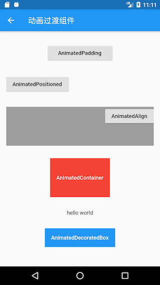

# 9.7 动画过渡组件

为了表述方便，本书约定，将在Widget属性发生变化时会执行过渡动画的组件统称为”动画过渡组件“，而动画过渡组件最明显的一个特征就是它会在内部自管理`AnimationController`。我们知道，为了方便使用者可以自定义动画的曲线、执行时长、方向等，在前面介绍过的动画封装方法中，通常都需要使用者自己提供一个`AnimationController`对象来自定义这些属性值。但是，如此一来，使用者就必须得手动管理`AnimationController`，这又会增加使用的复杂性。因此，如果也能将`AnimationController`进行封装，则会大大提高动画组件的易用性。

## 9.7.1 自定义动画过渡组件

我们要实现一个`AnimatedDecoratedBox`，它可以在`decoration`属性发生变化时，从旧状态变成新状态的过程可以执行一个过渡动画。根据前面所学的知识，我们实现了一个`AnimatedDecoratedBox1`组件：

```dart
class AnimatedDecoratedBox1 extends StatefulWidget {
  AnimatedDecoratedBox1({
    Key key,
    @required this.decoration,
    this.child,
    this.curve = Curves.linear,
    @required this.duration,
    this.reverseDuration,
  });

  final BoxDecoration decoration;
  final Widget child;
  final Duration duration;
  final Curve curve;
  final Duration reverseDuration;

  @override
  _AnimatedDecoratedBox1State createState() => _AnimatedDecoratedBox1State();
}

class _AnimatedDecoratedBox1State extends State<AnimatedDecoratedBox1>
    with SingleTickerProviderStateMixin {
  @protected
  AnimationController get controller => _controller;
  AnimationController _controller;

  Animation<double> get animation => _animation;
  Animation<double> _animation;

  DecorationTween _tween;

  @override
  Widget build(BuildContext context) {
    return AnimatedBuilder(
      animation: _animation,
      builder: (context, child){
        return DecoratedBox(
          decoration: _tween.animate(_animation).value,
          child: child,
        );
      },
      child: widget.child,
    );
  }

  @override
  void initState() {
    super.initState();
    _controller = AnimationController(
      duration: widget.duration,
      reverseDuration: widget.reverseDuration,
      vsync: this,
    );
    _tween = DecorationTween(begin: widget.decoration);
    _updateCurve();
  }

  void _updateCurve() {
    if (widget.curve != null)
      _animation = CurvedAnimation(parent: _controller, curve: widget.curve);
    else
      _animation = _controller;
  }


  @override
  void didUpdateWidget(AnimatedDecoratedBox1 oldWidget) {
    super.didUpdateWidget(oldWidget);
    if (widget.curve != oldWidget.curve)
      _updateCurve();
    _controller.duration = widget.duration;
    _controller.reverseDuration = widget.reverseDuration;
    if(widget.decoration!= (_tween.end ?? _tween.begin)){
      _tween
        ..begin = _tween.evaluate(_animation)
        ..end = widget.decoration;
      _controller
        ..value = 0.0
        ..forward();
    }
  }

  @override
  void dispose() {
    _controller.dispose();
    super.dispose();
  }
}
```

下面我们来使用`AnimatedDecoratedBox1`来实现按钮点击后背景色从蓝色过渡到红色的效果：

```dart
Color _decorationColor = Colors.blue;
var duration = Duration(seconds: 1);
...//省略无关代码
AnimatedDecoratedBox(
  duration: duration,
  decoration: BoxDecoration(color: _decorationColor),
  child: FlatButton(
    onPressed: () {
      setState(() {
        _decorationColor = Colors.red;
      });
    },
    child: Text(
      "AnimatedDecoratedBox",
      style: TextStyle(color: Colors.white),
    ),
  ),
)
```

点击前效果如图9-8所示，点击后截取了过渡过程的一帧如图9-9所示： 

点击后，按钮背景色会从蓝色向红色过渡，图9-9是过渡过程中的一帧，有点偏紫色，整个过渡动画结束后背景会变为红色。

上面的代码虽然实现了我们期望的功能，但是代码却比较复杂。稍加思考后，我们就可以发现，`AnimationController`的管理以及Tween更新部分的代码都是可以抽象出来的，如果我们这些通用逻辑封装成基类，那么要实现动画过渡组件只需要继承这些基类，然后定制自身不同的代码（比如动画每一帧的构建方法）即可，这样将会简化代码。

为了方便开发者来实现动画过渡组件的封装，Flutter提供了一个`ImplicitlyAnimatedWidget`抽象类，它继承自StatefulWidget，同时提供了一个对应的`ImplicitlyAnimatedWidgetState`类，`AnimationController`的管理就在`ImplicitlyAnimatedWidgetState`类中。开发者如果要封装动画，只需要分别继承`ImplicitlyAnimatedWidget`和`ImplicitlyAnimatedWidgetState`类即可，下面我们演示一下具体如何实现。

我们需要分两步实现：

1. 继承`ImplicitlyAnimatedWidget`类。

   ```dart
   class AnimatedDecoratedBox extends ImplicitlyAnimatedWidget {
     AnimatedDecoratedBox({
       Key key,
       @required this.decoration,
       this.child,
       Curve curve = Curves.linear, //动画曲线
       @required Duration duration, // 正向动画执行时长
       Duration reverseDuration, // 反向动画执行时长
     }) : super(
             key: key,
             curve: curve,
             duration: duration,
             reverseDuration: reverseDuration,
           );
     final BoxDecoration decoration;
     final Widget child;
   
     @override
     _AnimatedDecoratedBoxState createState() {
       return _AnimatedDecoratedBoxState();
     }
   }
   ```

   其中`curve`、`duration`、`reverseDuration`三个属性在`ImplicitlyAnimatedWidget `中已定义。 可以看到`AnimatedDecoratedBox`类和普通继承自`StatefulWidget`的类没有什么不同。

2. State类继承自`AnimatedWidgetBaseState`（该类继承自`ImplicitlyAnimatedWidgetState`类）。

   ```dart
   class _AnimatedDecoratedBoxState
       extends AnimatedWidgetBaseState<AnimatedDecoratedBox> {
     DecorationTween _decoration; //定义一个Tween
   
     @override
     Widget build(BuildContext context) {
       return DecoratedBox(
         decoration: _decoration.evaluate(animation),
         child: widget.child,
       );
     }
   
     @override
     void forEachTween(visitor) {
       // 在需要更新Tween时，基类会调用此方法
       _decoration = visitor(_decoration, widget.decoration,
           (value) => DecorationTween(begin: value));
     }
   }
   ```

   可以看到我们实现了` build`和`forEachTween`两个方法。在动画执行过程中，每一帧都会调用`build`方法（调用逻辑在`ImplicitlyAnimatedWidgetState`中），所以在`build`方法中我们需要构建每一帧的`DecoratedBox`状态，因此得算出每一帧的`decoration` 状态，这个我们可以通过` _decoration.evaluate(animation)` 来算出，其中`animation`是`ImplicitlyAnimatedWidgetState`基类中定义的对象，`_decoration`是我们自定义的一个`DecorationTween`类型的对象，那么现在的问题就是它是在什么时候被赋值的呢？要回答这个问题，我们就得搞清楚什么时候需要对`_decoration`赋值。我们知道`_decoration`是一个Tween，而Tween的主要职责就是定义动画的起始状态（begin）和终止状态(end)。对于`AnimatedDecoratedBox`来说，`decoration`的终止状态就是用户传给它的值，而起始状态是不确定的，有以下两种情况：

   1. `AnimatedDecoratedBox`首次build，此时直接将其`decoration`值置为起始状态，即`_decoration`值为`DecorationTween(begin: decoration)` 。
   2. `AnimatedDecoratedBox`的`decoration`更新时，则起始状态为`_decoration.animate(animation)`，即`_decoration`值为`DecorationTween(begin: _decoration.animate(animation)，end:decoration)`。
   

现在`forEachTween`的作用就很明显了，它正是用于来更新Tween的初始值的，在上述两种情况下会被调用，而开发者只需重写此方法，并在此方法中更新Tween的起始状态值即可。而一些更新的逻辑被屏蔽在了`visitor`回调，我们只需要调用它并给它传递正确的参数即可，`visitor`方法签名如下：

```dart
   Tween visitor(
     Tween<dynamic> tween, //当前的tween，第一次调用为null
     dynamic targetValue, // 终止状态
     TweenConstructor<dynamic> constructor，//Tween构造器，在上述三种情况下会被调用以更新tween
   );
```

可以看到，通过继承`ImplicitlyAnimatedWidget`和`ImplicitlyAnimatedWidgetState`类可以快速的实现动画过渡组件的封装，这和我们纯手工实现相比，代码简化了很多。

> 如果读者还有疑惑，建议查看`ImplicitlyAnimatedWidgetState`的源码并结合本示例代码对比理解。

### 动画过渡组件的反向动画

在使用动画过渡组件，我们只需要在改变一些属性值后重新build组件即可，所以要实现状态反向过渡，只需要将前后状态值互换即可实现，这本来是不需要再浪费笔墨的。但是`ImplicitlyAnimatedWidget`构造函数中却有一个`reverseDuration`属性用于设置反向动画的执行时长，这貌似在告诉读者`ImplicitlyAnimatedWidget`本身也提供了执行反向动画的接口，于是笔者查看了`ImplicitlyAnimatedWidgetState`源码并未发现有执行反向动画的接口，唯一有用的是它暴露了控制动画的`controller`。所以如果要让`reverseDuration`生效，我们只能先获取`controller`，然后再通过`controller.reverse()`来启动反向动画，比如我们在上面示例的基础上实现一个循环的点击背景颜色变换效果，要求从蓝色变为红色时动画执行时间为400ms，从红变蓝为2s，如果要使`reverseDuration`生效，我们需要这么做：

```dart
AnimatedDecoratedBox(
  duration: Duration( milliseconds: 400),
  decoration: BoxDecoration(color: _decorationColor),
  reverseDuration: Duration(seconds: 2),
  child: Builder(builder: (context) {
    return FlatButton(
      onPressed: () {
        if (_decorationColor == Colors.red) {
          ImplicitlyAnimatedWidgetState _state =
              context.findAncestorStateOfType<ImplicitlyAnimatedWidgetState>();
           // 通过controller来启动反向动画
          _state.controller.reverse().then((e) {
            // 经验证必须调用setState来触发rebuild，否则状态同步会有问题
            setState(() {
              _decorationColor = Colors.blue;
            });
          });
        } else {
          setState(() {
            _decorationColor = Colors.red;
          });
        }
      },
      child: Text(
        "AnimatedDecoratedBox toggle",
        style: TextStyle(color: Colors.white),
      ),
    );
  }),
)
```

上面的代码实际上是非常糟糕且没必要的，它需要我们了解`ImplicitlyAnimatedWidgetState `内部实现，并且要手动去启动反向动画。我们完全可以通过如下代码实现相同的效果：

```dart
AnimatedDecoratedBox(
  duration: Duration(
      milliseconds: _decorationColor == Colors.red ? 400 : 2000),
  decoration: BoxDecoration(color: _decorationColor),
  child: Builder(builder: (context) {
    return FlatButton(
      onPressed: () {
        setState(() {
          _decorationColor = _decorationColor == Colors.blue
              ? Colors.red
              : Colors.blue;
        });
      },
      child: Text(
        "AnimatedDecoratedBox toggle",
        style: TextStyle(color: Colors.white),
      ),
    );
  }),
)
```

这样的代码是不是优雅的多！那么现在问题来了，为什么`ImplicitlyAnimatedWidgetState `要提供一个`reverseDuration`参数呢？笔者仔细研究了`ImplicitlyAnimatedWidgetState `的实现，发现唯一的解释就是该参数并非是给`ImplicitlyAnimatedWidgetState `用的，而是给子类用的！原因正如我们前面说的，要使`reverseDuration` 有用就必须得获取`controller ` 属性来手动启动反向动画，`ImplicitlyAnimatedWidgetState `中的`controller ` 属性是一个保护属性，定义如下：

```dart
 @protected
  AnimationController get controller => _controller;
```

而保护属性原则上只应该在子类中使用，而不应该像上面示例代码一样在外部使用。综上，我们可以得出两条结论：

1. 使用动画过渡组件时如果需要执行反向动画的场景，应尽量使用状态互换的方法，而不应该通过获取`ImplicitlyAnimatedWidgetState `中`controller`的方式。

2. 如果我们自定义的动画过渡组件用不到`reverseDuration` ，那么最好就不要暴露此参数，比如我们上面自定义的`AnimatedDecoratedBox`定义中就可以去除`reverseDuration` 可选参数，如：

   ```dart
   class AnimatedDecoratedBox extends ImplicitlyAnimatedWidget {
     AnimatedDecoratedBox({
       Key key,
       @required this.decoration,
       this.child,
       Curve curve = Curves.linear,
       @required Duration duration,
     }) : super(
             key: key,
             curve: curve,
             duration: duration,
           );
   ```

## 9.7.2 Flutter预置的动画过渡组件

Flutter SDK中也预置了很多动画过渡组件，实现方式和大都和`AnimatedDecoratedBox`差不多，如表9-1所示：

| 组件名                   | 功能                                                         |
| ------------------------ | ------------------------------------------------------------ |
| AnimatedPadding          | 在padding发生变化时会执行过渡动画到新状态                    |
| AnimatedPositioned       | 配合Stack一起使用，当定位状态发生变化时会执行过渡动画到新的状态。 |
| AnimatedOpacity          | 在透明度opacity发生变化时执行过渡动画到新状态                |
| AnimatedAlign            | 当`alignment`发生变化时会执行过渡动画到新的状态。            |
| AnimatedContainer        | 当Container属性发生变化时会执行过渡动画到新的状态。          |
| AnimatedDefaultTextStyle | 当字体样式发生变化时，子组件中继承了该样式的文本组件会动态过渡到新样式。 |

<center>表9-1：Flutter预置的动画过渡组件</center>
下面我们通过一个示例来感受一下这些预置的动画过渡组件效果：

```dart
import 'package:flutter/material.dart';

class AnimatedWidgetsTest extends StatefulWidget {
  @override
  _AnimatedWidgetsTestState createState() => _AnimatedWidgetsTestState();
}

class _AnimatedWidgetsTestState extends State<AnimatedWidgetsTest> {
  double _padding = 10;
  var _align = Alignment.topRight;
  double _height = 100;
  double _left = 0;
  Color _color = Colors.red;
  TextStyle _style = TextStyle(color: Colors.black);
  Color _decorationColor = Colors.blue;

  @override
  Widget build(BuildContext context) {
    var duration = Duration(seconds: 5);
    return SingleChildScrollView(
      child: Column(
        children: <Widget>[
          RaisedButton(
            onPressed: () {
              setState(() {
                _padding = 20;
              });
            },
            child: AnimatedPadding(
              duration: duration,
              padding: EdgeInsets.all(_padding),
              child: Text("AnimatedPadding"),
            ),
          ),
          SizedBox(
            height: 50,
            child: Stack(
              children: <Widget>[
                AnimatedPositioned(
                  duration: duration,
                  left: _left,
                  child: RaisedButton(
                    onPressed: () {
                      setState(() {
                        _left = 100;
                      });
                    },
                    child: Text("AnimatedPositioned"),
                  ),
                )
              ],
            ),
          ),
          Container(
            height: 100,
            color: Colors.grey,
            child: AnimatedAlign(
              duration: duration,
              alignment: _align,
              child: RaisedButton(
                onPressed: () {
                  setState(() {
                    _align = Alignment.center;
                  });
                },
                child: Text("AnimatedAlign"),
              ),
            ),
          ),
          AnimatedContainer(
            duration: duration,
            height: _height,
            color: _color,
            child: FlatButton(
              onPressed: () {
                setState(() {
                  _height = 150;
                  _color = Colors.blue;
                });
              },
              child: Text(
                "AnimatedContainer",
                style: TextStyle(color: Colors.white),
              ),
            ),
          ),
          AnimatedDefaultTextStyle(
            child: GestureDetector(
              child: Text("hello world"),
              onTap: () {
                setState(() {
                  _style = TextStyle(
                    color: Colors.blue,
                    decorationStyle: TextDecorationStyle.solid,
                    decorationColor: Colors.blue,
                  );
                });
              },
            ),
            style: _style,
            duration: duration,
          ),
          AnimatedDecoratedBox(
            duration: duration,
            decoration: BoxDecoration(color: _decorationColor),
            child: FlatButton(
              onPressed: () {
                setState(() {
                  _decorationColor = Colors.red;
                });
              },
              child: Text(
                "AnimatedDecoratedBox",
                style: TextStyle(color: Colors.white),
              ),
            ),
          )
        ].map((e) {
          return Padding(
            padding: EdgeInsets.symmetric(vertical: 16),
            child: e,
          );
        }).toList(),
      ),
    );
  }
}
```

运行后效果如图9-10所示：



读者可以点击一下相应组件来查看一下实际的运行效果。
